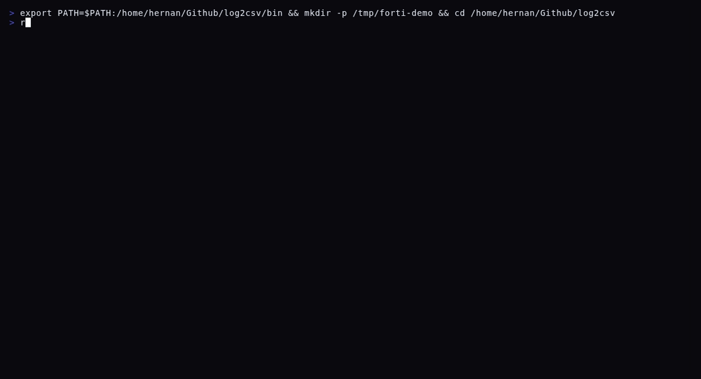

# Rocket

[](https://go.dev)
[](https://github.com/hernannh/rocket/releases)
[](LICENSE)
[](https://github.com/hernannh/rocket/releases)
[](#supported-log-formats)
[](#sigma)
[](#geoip)

**Kit de herramientas de analisis de logs para Blue Team** — Convierte cualquier formato de log a CSV o JSON estructurado en segundos. Un unico binario estatico que parsea, filtra, correlaciona y enriquece logs de firewalls, SIEM, Windows EVTX, syslog, DNS y mas.

Rocket fue creado para analistas SOC, respondedores de incidentes e investigadores forenses que necesitan procesar logs rapidamente, en cualquier maquina, sin instalar dependencias.

---

### Analisis de fuerza bruta SSH


### Analisis de FortiGate IPS



### Analisis de servidor web Nginx


---

## Por que Rocket?

- **Exportacion a CSV y JSON** — Convierte cualquier formato de log a CSV estructurado (Excel, bases de datos) o JSON Lines (jq, Splunk, Elasticsearch). Selecciona campos especificos con `--fields` para reducir el ruido. El valor principal de Rocket.
- **Un unico binario estatico** (4.5 MB) — Copialo a cualquier maquina via SCP y ejecutalo. Sin Python, sin Java, sin runtime. Funciona en estaciones forenses, servidores comprometidos, sistemas aislados.
- **11 formatos de log** con auto-deteccion — keyvalue, json, syslog, cef, leef, apache, w3c, nginx-error, bind9, android y Windows EVTX (parseo binario nativo). Lee archivos comprimidos `.gz` de forma transparente.
- **Filtrado avanzado** — Busqueda de texto, exclusion, regex, rangos de fechas, deduplicacion. Lee desde stdin, escribe a stdout. Combina filtros libremente.
- **E/S en streaming** — Maneja archivos de logs de multiples GB sin cargarlos en memoria. Mas de 500K registros/segundo en syslog. Procesamiento concurrente con workers configurables.
- **Inteligencia de amenazas integrada** — Extraccion de IOC, motor de reglas Sigma, resolucion GeoIP y generador de lineas de tiempo en una sola herramienta. Sin necesidad de scripts separados.

---

## Tabla de contenidos

- [Instalacion](#instalacion)
- [Inicio rapido](#inicio-rapido)
- [Formatos de log soportados](#formatos-de-log-soportados)
- [Comandos](#comandos)
  - [parse](#parse) — Convertir logs a CSV/JSON
  - [stats](#stats) — Triaje rapido y analisis de campos
  - [ioc](#ioc) — Extraer Indicadores de Compromiso
  - [timeline](#timeline) — Linea de tiempo cronologica unificada
  - [sigma](#sigma) — Motor de reglas de deteccion Sigma
  - [geoip](#geoip) — Geolocalizacion de IP con GeoLite2
  - [tail](#tail) — Monitoreo de logs en tiempo real
  - [merge](#merge) — Combinar multiples archivos CSV
  - [formats](#formats) — Listar formatos soportados
  - [version](#version) — Informacion de compilacion
- [Filtrado](#filtrado)
- [Formatos de salida](#formatos-de-salida)
- [Casos de uso](#casos-de-uso)
- [Rendimiento](#rendimiento)
- [Configuracion de base de datos GeoIP](#configuracion-de-base-de-datos-geoip)
- [Reglas Sigma](#reglas-sigma)
- [Soporte de plataformas](#soporte-de-plataformas)

---

## Instalacion

Descarga el binario para tu plataforma desde la pagina de [Releases](https://github.com/hernannh/rocket/releases).

### Linux (amd64)

```bash
chmod +x rocket-linux-amd64
sudo mv rocket-linux-amd64 /usr/local/bin/rocket
```

### macOS

```bash
chmod +x rocket-darwin-arm64
sudo mv rocket-darwin-arm64 /usr/local/bin/rocket
```

### Windows

Descarga `rocket-windows-amd64.exe` y agregalo a tu PATH, o ejecutalo directamente.

### Verificar instalacion

```bash
rocket version
```

---

## Inicio rapido

```bash
# Parsear un archivo de log (auto-detecta el formato)
rocket parse access.log

# Parsear un directorio recursivamente y combinar todos los resultados
rocket parse /var/log/ -r --merge -o ./output/

# Triaje rapido — IPs principales, eventos, usuarios
rocket stats Security.evtx --fields event_id,Event.EventData.TargetUserName --top 15

# Extraer IOCs (IPs, dominios, hashes, URLs)
rocket ioc firewall.log --top 20

# Construir una linea de tiempo desde multiples fuentes
rocket timeline Security.evtx syslog firewall.log -o timeline.csv

# Aplicar reglas de deteccion Sigma
rocket sigma Security.evtx --rules ./sigma-rules/

# Resolver GeoIP para IPs de atacantes
rocket geoip firewall.log --db ./geodb/ --top 20

# Monitorear un archivo de log en tiempo real
rocket tail /var/log/syslog -f --filter "fail" --format syslog
```

---

## Formatos de log soportados

| Formato | Descripcion | Auto-deteccion | Ejemplos |
|---|---|---|---|
| **keyvalue** | Pares clave=valor | Si | FortiGate, FortiAnalyzer, Palo Alto, logs de aplicaciones genericas |
| **json** | JSON Lines / NDJSON | Si | Elasticsearch, CloudWatch, Docker, logs de aplicaciones estructuradas |
| **syslog** | BSD, RFC 5424, RFC 3339 | Si | Linux syslog, rsyslog, systemd-journal, dispositivos de red |
| **cef** | ArcSight Common Event Format | Si | ArcSight, FortiSIEM, CrowdStrike, cualquier fuente compatible con CEF |
| **leef** | IBM QRadar LEEF 1.0/2.0 | Si | QRadar, productos de seguridad IBM |
| **apache** | Combined y Common Log Format | Si | Apache, Nginx (con formato common log), HAProxy |
| **w3c** | W3C Extended Log Format | Si | IIS, Microsoft TMG, algunos proveedores CDN |
| **nginx-error** | Formato de log de error de Nginx | Si | Logs de error de Nginx con extraccion de cliente/servidor |
| **bind9** | Logs del servidor DNS BIND9 | Si | Logs de consultas DNS y logs de seguridad |
| **android** | Android logcat (threadtime) | Si | Logs de sistema y aplicaciones Android |
| **evtx** | Windows Event Log (binario) | Por extension | Security.evtx, System.evtx, Application.evtx |

### Auto-deteccion de formato

Rocket analiza las primeras 20 lineas de cada archivo y las evalua contra todos los parsers registrados. Se selecciona el parser con la puntuacion de confianza mas alta. Para archivos EVTX, la deteccion se basa en la extension de archivo `.evtx`.

Puedes forzar un formato especifico con `--format` / `-f`:

```bash
rocket parse mixed.log --format syslog
rocket parse data.txt -f keyvalue
```

---

## Comandos

### parse

Convierte uno o mas archivos de log a formato CSV o JSON.

```
rocket parse <input> [flags]
```

**Flags:**

| Flag | Corto | Descripcion |
|---|---|---|
| `--output` | `-o` | Directorio de salida (por defecto: mismo que la entrada) |
| `--format` | `-f` | Formato de log: auto, keyvalue, json, syslog, cef, leef, apache, w3c, nginx-error, bind9, android, evtx (por defecto: auto) |
| `--output-format` | | Formato de salida: csv, json (por defecto: csv) |
| `--filter` | | Mantener solo lineas que contengan este texto (sin distincion de mayusculas) |
| `--exclude` | | Excluir lineas que contengan este texto (sin distincion de mayusculas) |
| `--regex` | | Mantener solo lineas que coincidan con este patron regex |
| `--fields` | | Lista de campos separados por comas para incluir en la salida |
| `--date-range` | | Filtro de rango de fechas: YYYY-MM-DD:YYYY-MM-DD |
| `--dedup` | | Eliminar registros duplicados |
| `--dedup-fields` | | Campos a usar para dedup (por defecto: linea completa) |
| `--recursive` | `-r` | Escanear subdirectorios recursivamente |
| `--merge` | | Combinar todas las salidas en un solo archivo |
| `--workers` | `-w` | Numero de workers concurrentes (por defecto: 4) |
| `--stdout` | | Escribir salida a stdout en lugar de archivos |

**Ejemplos:**

```bash
# Conversion basica
rocket parse access.log
rocket parse /var/log/app/ -r -o ./output/

# Filtrado y seleccion de campos
rocket parse firewall.log --filter "blocked" --fields srcip,dstip,action,attack
rocket parse syslog --exclude "CRON" --fields timestamp,program,message

# Filtrado con regex
rocket parse firewall.log --regex 'CVE-\d{4}-\d+'
rocket parse auth.log --regex 'Failed password.*from \d+\.\d+'

# Rango de fechas
rocket parse /var/log/ -r --date-range 2026-03-01:2026-03-31

# Salida JSON piped a jq
rocket parse firewall.log --output-format json --stdout | jq '.srcip'

# Deduplicacion
rocket parse firewall.log --dedup --dedup-fields srcip,attack

# Windows Event Logs
rocket parse Security.evtx -o ./output/
rocket parse C:\Windows\System32\winevt\Logs\ -r --merge

# Logs DNS
rocket parse query.log -f bind9 --fields client_ip,domain,record_type

# Multiples entradas
rocket parse server1.log server2.log server3.log -o ./merged/ --merge

# Leer desde stdin (pipe)
cat /var/log/syslog | rocket parse -f syslog --fields program,message -
ssh forensic-server "cat /var/log/auth.log" | rocket parse -f syslog --filter "Failed" -

# Archivos comprimidos (.gz)
rocket parse /var/log/syslog.2.gz /var/log/syslog.3.gz -o ./output/

# Procesamiento por lotes de alto rendimiento
rocket parse /evidence/logs/ -r --workers 8 --merge -o ./case-output/
```

**Tipos de entrada soportados:**
- Archivo individual: `rocket parse access.log`
- Multiples archivos: `rocket parse file1.log file2.log file3.log`
- Directorio: `rocket parse /var/log/`
- Directorio (recursivo): `rocket parse /var/log/ -r`
- Patron glob: `rocket parse "*.log"`
- Comprimido gzip: `rocket parse syslog.2.gz`
- Stdin: `cat file | rocket parse -f syslog -`

---

### stats

Triaje rapido — analiza archivos de log y muestra los valores principales por campo sin generar archivos de salida.

```
rocket stats <input> [flags]
```

**Flags:**

| Flag | Corto | Descripcion |
|---|---|---|
| `--format` | `-f` | Formato de log (por defecto: auto) |
| `--fields` | | Campos separados por comas para analizar (por defecto: todos) |
| `--top` | | Numero de valores principales por campo (por defecto: 10) |
| `--recursive` | `-r` | Escanear subdirectorios |

**Ejemplos:**

```bash
# Vista general de todos los campos
rocket stats access.log

# Enfocarse en campos especificos
rocket stats firewall.log --fields srcip,attack,severity,srccountry --top 15

# Triaje de Windows Event Log
rocket stats Security.evtx --fields event_id,Event.EventData.TargetUserName,Event.EventData.LogonType

# Analisis de consultas DNS
rocket stats query.log --fields domain,record_type,client_ip --top 20

# Analisis de servicios syslog
rocket stats /var/log/syslog -r --format syslog --fields program,hostname --top 20
```

**Ejemplo de salida:**

```
=== Summary ===
Total records: 613
Unique fields: 4

--- attack (19 unique values) ---
       186  Mirai.Botnet
       134  ZGrab.Scanner
        75  Nmap.Script.Scanner
        33  Apache.HTTP.Server.cgi-bin.Path.Traversal
        32  WordPress.REST.API.Username.Enumeration.Information.Disclosure
  ... and 14 more

--- srcip (351 unique values) ---
        18  45.205.1.20
        15  172.233.29.203
        15  20.43.23.11
  ... and 346 more
```

---

### ioc

Extraer Indicadores de Compromiso (IOCs) de archivos de log.

```
rocket ioc <input> [flags]
```

**Tipos de IOC soportados:**

| Tipo | Descripcion | Ejemplo |
|---|---|---|
| `ipv4` | Direcciones IPv4 (solo publicas) | `45.205.1.20` |
| `ipv6` | Direcciones IPv6 | `2001:db8::1` |
| `domain` | Nombres de dominio | `evil.example.com` |
| `url` | URLs HTTP/HTTPS | `https://malware.site/payload` |
| `email` | Direcciones de correo electronico | `attacker@evil.com` |
| `md5` | Hashes MD5 (32 caracteres hex) | `d41d8cd98f00b204e9800998ecf8427e` |
| `sha1` | Hashes SHA1 (40 caracteres hex) | `da39a3ee5e6b4b0d3255bfef95601890afd80709` |
| `sha256` | Hashes SHA256 (64 caracteres hex) | `e3b0c44298fc1c149afbf4c8996fb924...` |

Los rangos de IP privadas/reservadas (10.x, 172.16.x, 192.168.x, 127.x) se excluyen automaticamente.

**Flags:**

| Flag | Corto | Descripcion |
|---|---|---|
| `--format` | `-f` | Formato de log (por defecto: auto) |
| `--types` | | Tipos de IOC separados por comas para extraer (por defecto: todos) |
| `--output-format` | | Salida: text, json (por defecto: text) |
| `--top` | | Numero de IOCs principales por tipo (por defecto: 20) |
| `--recursive` | `-r` | Escanear subdirectorios |

**Ejemplos:**

```bash
# Extraer todos los IOCs
rocket ioc firewall.log

# Solo IPs y dominios
rocket ioc access.log --types ipv4,domain --top 30

# Salida JSON para integracion con otras herramientas
rocket ioc /var/log/ -r --output-format json > iocs.json

# Desde EVTX
rocket ioc Security.evtx --types ipv4,domain

# Desde stdin
cat syslog | rocket ioc - -f syslog --types ipv4
```

---

### timeline

Construye una linea de tiempo cronologica unificada desde multiples fuentes de logs. Esencial para la reconstruccion de incidentes.

```
rocket timeline <input> [inputs...] [flags]
```

Cada evento se enriquece con:
- `timeline_ts` — Timestamp normalizado para ordenamiento
- `source` — Ruta del archivo original

**Flags:**

| Flag | Corto | Descripcion |
|---|---|---|
| `--output` | `-o` | Ruta del archivo de salida (por defecto: timeline.csv) |
| `--format` | `-f` | Formato de log (por defecto: auto por archivo) |
| `--output-format` | | Salida: csv, json (por defecto: csv) |
| `--fields` | | Campos separados por comas para incluir |
| `--filter` | | Mantener solo lineas que contengan este texto |
| `--exclude` | | Excluir lineas que contengan este texto |
| `--recursive` | `-r` | Escanear subdirectorios |

**Ejemplos:**

```bash
# Combinar logs de Windows + Linux + Firewall
rocket timeline Security.evtx syslog firewall.log -o timeline.csv

# Linea de tiempo JSON para ingesta en Elastic/Splunk
rocket timeline /evidence/ -r --output-format json -o timeline.json

# Linea de tiempo filtrada
rocket timeline Security.evtx auth.log --filter "failed" --fields timeline_ts,source,message
```

---

### sigma

Aplica reglas de deteccion Sigma contra registros de log parseados. Sigma es el estandar abierto para reglas de deteccion SIEM utilizado por la comunidad de ciberseguridad.

```
rocket sigma <input> [flags]
```

**Flags:**

| Flag | Corto | Descripcion |
|---|---|---|
| `--rules` | | Ruta al directorio de reglas Sigma o archivo .yml individual **(requerido)** |
| `--format` | `-f` | Formato de log (por defecto: auto) |
| `--output-format` | | Salida: text, json (por defecto: text) |
| `--output` | `-o` | Archivo de salida (por defecto: stdout) |
| `--recursive` | `-r` | Escanear subdirectorios |

**Caracteristicas Sigma soportadas:**

| Caracteristica | Soporte |
|---|---|
| Coincidencia de campos (exacta) | Si |
| Modificadores de campo: `contains`, `startswith`, `endswith` | Si |
| Coincidencia con comodines (`*`) | Si |
| Condiciones: `and`, `or`, `not` | Si |
| Condiciones: `1 of them`, `all of them` | Si |
| Condiciones: `1 of selection_*`, `all of selection_*` | Si |
| Listas de palabras clave (coincidir en todos los campos) | Si |
| Parentesis en condiciones | Si |

**Ejemplos:**

```bash
# Escanear con un directorio de reglas
rocket sigma Security.evtx --rules ./sigma-rules/

# Regla individual
rocket sigma firewall.log --rules mirai_detection.yml

# Salida JSON para procesamiento adicional
rocket sigma /var/log/ -r --rules ./rules/ --output-format json -o detections.json

# Combinar con syslog
rocket sigma auth.log --rules brute_force.yml --format syslog
```

**Ejemplo de regla Sigma:**

```yaml
title: Mirai Botnet Detection
id: a1b2c3d4-e5f6-7890-abcd-ef1234567890
status: stable
level: critical
description: Detects Mirai botnet activity in IPS logs
logsource:
    category: ids
    product: fortigate
detection:
    selection:
        attack|contains: Mirai
    condition: selection
```

**Ejemplo de regla Sigma para Windows:**

```yaml
title: Remote Desktop Logon Detected
id: c3d4e5f6-a7b8-9012-cdef-123456789012
status: stable
level: medium
description: Detects RDP logon events (LogonType 10)
logsource:
    product: windows
    service: security
detection:
    selection:
        event_id: '4624'
        Event.EventData.LogonType: '10'
    condition: selection
```

Puedes usar reglas del repositorio de la comunidad [SigmaHQ](https://github.com/SigmaHQ/sigma).

---

### geoip

Resuelve datos de geolocalizacion (pais, ASN, organizacion) para direcciones IP encontradas en archivos de log.

```
rocket geoip <input> [flags]
```

**Flags:**

| Flag | Corto | Descripcion |
|---|---|---|
| `--db` | | Ruta al archivo mmdb o directorio con archivos mmdb **(requerido)** |
| `--format` | `-f` | Formato de log (por defecto: auto) |
| `--fields` | | Campos a escanear en busca de IPs (por defecto: todos) |
| `--top` | | Numero de IPs principales a mostrar (por defecto: 20) |
| `--recursive` | `-r` | Escanear subdirectorios |

**Ejemplos:**

```bash
# Geolocalizacion basica
rocket geoip firewall.log --db ./GeoLite2-Country.mmdb

# Multiples bases de datos (directorio)
rocket geoip firewall.log --db ./geodb/ --top 30

# Enfocarse en campos de IP especificos
rocket geoip firewall.log --db ./geodb/ --fields srcip,dstip

# Archivos EVTX
rocket geoip Security.evtx --db ./geodb/
```

**Ejemplo de salida:**

```
=== GeoIP Resolution (160 unique public IPs) ===

COUNT     IP                  CC   COUNTRY                 ASN       ORGANIZATION
--------  ------------------  ---  ----------------------  --------  ------------
43        172.93.48.52        US   United States           29802     HIVELOCITY, Inc.
22        87.251.64.141       US   United States           200730    ISAEV Igor
20        45.161.237.218      PY   Paraguay                61512     GIG@NET SOCIEDAD ANONIMA
15        89.168.34.129       FR   France                  31898     Oracle Corporation
15        103.76.120.225      ID   Indonesia               136052    PT Cloud Hosting Indonesia

=== Events by Country ===

       161  United States
       106  China
        74  Romania
        61  Hong Kong
        60  Indonesia
```

Consulta [Configuracion de base de datos GeoIP](#configuracion-de-base-de-datos-geoip) para instrucciones de descarga.

---

### tail

Monitorea un archivo de log en tiempo real con parseo estructurado, filtrado y formato. Como `tail -f` pero con inteligencia.

```
rocket tail <file> [flags]
```

**Flags:**

| Flag | Corto | Descripcion |
|---|---|---|
| `--follow` | `-f` | Seguir el archivo para nuevas lineas (como tail -f) |
| `--format` | | Formato de log (por defecto: auto) |
| `--filter` | | Mantener solo lineas que contengan este texto |
| `--exclude` | | Excluir lineas que contengan este texto |
| `--regex` | | Mantener solo lineas que coincidan con este regex |
| `--fields` | | Campos separados por comas para mostrar |
| `--output-format` | | Salida: text, json, csv (por defecto: text) |

**Ejemplos:**

```bash
# Monitoreo en tiempo real
rocket tail /var/log/syslog -f --format syslog

# Filtrar por fallas
rocket tail /var/log/auth.log -f --filter "fail" --format syslog

# Mostrar campos especificos
rocket tail /var/log/syslog -f --fields timestamp,program,message --format syslog

# Salida JSON para piping
rocket tail firewall.log -f --output-format json --fields srcip,action

# Excluir ruido
rocket tail /var/log/syslog -f --exclude "CRON" --format syslog
```

---

### merge

Combina multiples archivos CSV en un unico CSV unificado. Maneja archivos con diferentes conjuntos de columnas creando una union de todos los encabezados.

```
rocket merge <file1.csv> <file2.csv> [files...] [flags]
```

**Flags:**

| Flag | Corto | Descripcion |
|---|---|---|
| `--output` | `-o` | Ruta del archivo de salida (por defecto: merged_logs.csv) |

**Ejemplos:**

```bash
rocket merge output1.csv output2.csv -o merged.csv
rocket merge *.csv -o all_logs.csv
```

---

### formats

Lista todos los formatos de log soportados.

```bash
rocket formats
```

**Salida:**

```
FORMAT       DESCRIPTION
------       -----------
keyvalue     Key=value pairs (e.g., user=admin action=login status="ok")
json         JSON lines / NDJSON (one JSON object per line)
syslog       Syslog (BSD, RFC 5424, and RFC 3339/rsyslog formats)
cef          ArcSight Common Event Format (CEF)
leef         IBM QRadar Log Event Extended Format (LEEF 1.0/2.0)
apache       Apache access logs (Combined and Common Log Format)
w3c          W3C Extended Log File Format (IIS, proxies)
nginx-error  Nginx error log format
bind9        BIND9 DNS server logs (query and security)
android      Android logcat (threadtime format)
evtx         Windows Event Log (.evtx) — Security, System, Application
```

---

### version

Muestra informacion de compilacion.

```bash
rocket version
```

```
rocket v1.0.0
  commit:  a1b2c3d
  built:   2026-03-31T00:00:00Z
  go:      go1.22.0
  os/arch: linux/amd64
```

---

## Filtrado

Rocket proporciona multiples mecanismos de filtrado que se pueden combinar:

| Filtro | Flag | Descripcion |
|---|---|---|
| Texto (incluir) | `--filter "ERROR"` | Coincidencia de subcadena sin distincion de mayusculas |
| Texto (excluir) | `--exclude "CRON"` | Exclusion de subcadena sin distincion de mayusculas |
| Regex | `--regex 'CVE-\d{4}-\d+'` | Coincidencia de patron regex completo |
| Rango de fechas | `--date-range 2026-03-01:2026-03-31` | Rango de fechas ISO (inclusivo) |
| Dedup | `--dedup` | Eliminar lineas duplicadas exactas |
| Dedup por campos | `--dedup --dedup-fields srcip,attack` | Dedup por combinacion de campos especificos |
| Seleccion de campos | `--fields srcip,attack,severity` | Solo incluir estas columnas en la salida |

**Los filtros se pueden combinar:**

```bash
rocket parse firewall.log \
  --filter "blocked" \
  --exclude "scanner" \
  --regex 'srcip=45\.' \
  --date-range 2026-03-01:2026-03-31 \
  --dedup --dedup-fields srcip,attack \
  --fields srcip,attack,severity,srccountry
```

---

## Formatos de salida

### CSV (por defecto)

CSV estandar con encabezados. Compatible con Excel, Google Sheets, LibreOffice, pandas, bases de datos.

```bash
rocket parse firewall.log -o ./output/
```

### JSON Lines (NDJSON)

Un objeto JSON por linea. Compatible con `jq`, Splunk, Elasticsearch, Logstash, scripts personalizados.

```bash
rocket parse firewall.log --output-format json -o ./output/
```

### Pipe a jq

```bash
rocket parse firewall.log --output-format json --stdout | jq 'select(.severity == "critical")'
rocket parse firewall.log --output-format json --stdout | jq -r '.srcip' | sort -u
rocket parse Security.evtx --output-format json --stdout | jq 'select(.event_id == "4625")'
```

### Pipe a otras herramientas

```bash
# Contar IPs unicas
rocket parse firewall.log --fields srcip --stdout | tail -n +2 | sort -u | wc -l

# Alimentar a grep
rocket parse firewall.log --output-format json --stdout | grep "Mirai"

# Importar a SQLite
rocket parse firewall.log -o output.csv
sqlite3 analysis.db ".import --csv output.csv logs"
```

---

## Casos de uso

### Respuesta a incidentes

```bash
# 1. Recolectar evidencia de multiples fuentes
scp target:/var/log/syslog* ./evidence/
scp target:/var/log/auth.log* ./evidence/
# Copiar EVTX desde Windows (via WinSCP, imagen forense, etc.)

# 2. Construir una linea de tiempo unificada
rocket timeline ./evidence/ -r -o timeline.csv

# 3. Triaje rapido
rocket stats ./evidence/ -r --fields program,hostname,event_id

# 4. Extraer IOCs
rocket ioc ./evidence/ -r --output-format json > iocs.json

# 5. Aplicar reglas de deteccion Sigma
rocket sigma ./evidence/ -r --rules ./sigma-rules/ --output-format json > detections.json

# 6. Resolucion GeoIP de IPs de atacantes
rocket geoip ./evidence/ -r --db ./geodb/ --top 50
```

### Caza de amenazas

```bash
# Encontrar movimiento lateral (sesiones RDP)
rocket parse Security.evtx --output-format json --stdout | \
  jq 'select(.event_id == "4624") | select(.["Event.EventData.LogonType"] == "10")'

# Buscar ataques de path traversal
rocket parse firewall.log --regex '\.\./|%2e%2e' --fields srcip,url,attack

# Encontrar patrones de fuerza bruta
rocket parse auth.log -f syslog --filter "Failed password" --fields timestamp,message

# Analizar consultas DNS en busca de dominios sospechosos
rocket stats query.log -f bind9 --fields domain,client_ip --top 20

# Extraer todos los CVEs que estan siendo explotados
rocket parse firewall.log --regex 'CVE-\d{4}-\d+' --fields srcip,attack,cve --output-format json --stdout | \
  jq -r '.cve' | sort | uniq -c | sort -rn
```

### Operaciones diarias del SOC

```bash
# Triaje matutino — que paso durante la noche
rocket stats /var/log/fortigate.log --fields attack,severity,srcip --top 10

# Monitoreo en tiempo real durante un incidente
rocket tail /var/log/syslog -f --filter "fail" --format syslog --fields timestamp,program,message

# Procesar exportacion de FortiAnalyzer
rocket parse ./forti-export/ -r --merge -o ./daily-report/ --workers 8

# Filtrar falsos positivos conocidos
rocket parse firewall.log --exclude "scanner" --exclude "monitor" --fields srcip,attack,severity
```

### Analisis forense

```bash
# Procesar Windows Event Logs desde imagen de disco
rocket parse /mnt/evidence/Windows/System32/winevt/Logs/ -r -o ./case-42/

# Enfocarse en eventos relevantes de seguridad
rocket parse Security.evtx --output-format json --stdout | \
  jq 'select(.event_id == "4688")' | \  # Creacion de procesos
  jq 'select(.["Event.EventData.NewProcessName"] | test("powershell|cmd|wscript"))'

# Descomprimir y procesar logs rotados
rocket parse /mnt/evidence/var/log/syslog* /mnt/evidence/var/log/auth.log* -o ./case-42/
```

---

## Rendimiento

Benchmarks de archivos de log del mundo real:

| Fuente | Tamano | Registros | Tiempo | Rendimiento |
|---|---|---|---|---|
| FortiAnalyzer (3 archivos) | 5.5 MB | 5,914 | 0.21s | 28,162 registros/s |
| Linux syslog (5 archivos, 3 .gz) | 2.9 MB | 61,215 | 0.12s | 510,125 registros/s |
| Windows EVTX (3 archivos) | 51 MB | 113,030 | 5.3s | 21,325 registros/s |
| BIND9 DNS (2 archivos) | 19 MB | 144,089 | 1.2s | 120,074 registros/s |
| Nginx (18 archivos, 9 .gz) | 4.8 MB | 17,703 | 0.08s | 221,288 registros/s |
| Timeline (EVTX + syslog + FW) | Mixto | 33,245 | 2.1s | 15,831 registros/s |

- El procesamiento concurrente escala con los nucleos de CPU disponibles (configurable con `--workers`)
- Los archivos gzip se descomprimen al vuelo sin uso adicional de disco
- El uso de memoria se mantiene constante independientemente del tamano del archivo (E/S en streaming)

---

## Configuracion de base de datos GeoIP

Rocket utiliza bases de datos MaxMind GeoLite2 en formato MMDB. Son gratuitas y se actualizan regularmente.

### Descargar bases de datos

```bash
mkdir -p geodb
wget -O geodb/GeoLite2-Country.mmdb \
  "https://github.com/P3TERX/GeoLite.mmdb/raw/download/GeoLite2-Country.mmdb"
wget -O geodb/GeoLite2-ASN.mmdb \
  "https://github.com/P3TERX/GeoLite.mmdb/raw/download/GeoLite2-ASN.mmdb"
wget -O geodb/GeoLite2-City.mmdb \
  "https://github.com/P3TERX/GeoLite.mmdb/raw/download/GeoLite2-City.mmdb"
```

### Uso

```bash
# Apuntar a un directorio (auto-detecta tipos de base de datos)
rocket geoip firewall.log --db ./geodb/

# Apuntar a un archivo individual
rocket geoip firewall.log --db ./geodb/GeoLite2-Country.mmdb
```

El flag `--db` acepta:
- Un directorio que contenga archivos `.mmdb` (auto-detecta Country, ASN, City por nombre de archivo)
- Un archivo `.mmdb` individual

---

## Reglas Sigma

### Que es Sigma?

[Sigma](https://github.com/SigmaHQ/sigma) es un estandar abierto para escribir reglas de deteccion que pueden compartirse entre sistemas SIEM. Rocket incluye un motor Sigma integrado que evalua las reglas directamente contra los registros de log parseados.

### Usar reglas de la comunidad

```bash
# Clonar el repositorio SigmaHQ
git clone https://github.com/SigmaHQ/sigma.git

# Escanear logs de Windows contra reglas de Windows
rocket sigma Security.evtx --rules ./sigma/rules/windows/

# Escanear logs web contra reglas web
rocket sigma access.log --rules ./sigma/rules/web/
```

### Escribir reglas personalizadas

Crea un archivo `.yml` siguiendo la especificacion Sigma:

```yaml
title: Brute Force SSH Detection
id: unique-uuid-here
status: stable
level: high
description: Detects multiple failed SSH login attempts
logsource:
    product: linux
    service: auth
detection:
    selection:
        program: sshd
        message|contains: "Failed password"
    condition: selection
```

```bash
rocket sigma /var/log/auth.log --rules brute_force_ssh.yml -f syslog
```

---

## Soporte de plataformas

| Plataforma | Arquitectura | Binario |
|---|---|---|
| Linux | amd64 | `rocket-linux-amd64` |
| Linux | arm64 | `rocket-linux-arm64` |
| Windows | amd64 | `rocket-windows-amd64.exe` |
| macOS | amd64 (Intel) | `rocket-darwin-amd64` |
| macOS | arm64 (Apple Silicon) | `rocket-darwin-arm64` |

Todos los binarios son:
- Enlazados estaticamente (sin dependencias de bibliotecas compartidas)
- Compilados con `CGO_ENABLED=0` (Go puro)
- Sin simbolos de depuracion (`-s -w`)
- Listos para ejecutar en cualquier maquina sin instalacion

---

## Licencia

Licenciado bajo [Apache License 2.0](LICENSE). Eres libre de usar, modificar y distribuir este software. Se requiere atribucion al autor original.

---

Desarrollado por Hernan Herrera - [Sockets AR](https://sockets.ar)

Sitio web: [rocket.sockets.ar](https://rocket.sockets.ar)
